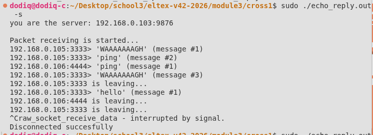
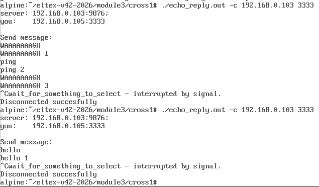
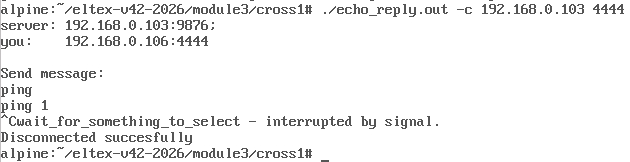

# Кросс-задание №1
## Текст задания
Написать echo-client и echo-server на raw сокетах. Сервер должен отвечать клиенту то же самое сообщение + порядковый номер сообщения от этого клиента. Протокол сообщения – UDP.  
Например:
- Клиент 1 посылает на сервер сообщение “WAAAAAAAGH”  
- Сервер отвечает клиенту 1 “WAAAAAAAGH 1”  
- Клиент 1 посылает серверу сообщение “ping”  
- Сервер отвечает клиенту 1 “ping 2”  
- Клиент 2 посылает серверу сообщение “ping”  
- Сервер отвечает клиенту 2 “ping 1”  
- Клиент 1 посылает на сервер сообщение “WAAAAAAAGH”  
- Сервер отвечает клиенту 1 “WAAAAAAAGH 3” 

При штатном выключении (в том числе при получении сигнала) клиент должен посылать серверу сообщение о закрытии, после получения этого сообщения сервер должен сбросить связанные с данным клиентом счетчики и при последующем подключении клиента с тем же ip:port, начинать отсчет с 1.

## Компиляция
```bash
make
```
При этом собирается статическая библиотека с функциями для работы с RAW-сокетом, а также компилируются дополнительные модули-обертки, использующие функции библиотеки. Создается исполняемый файл echo_reply.out.

## Запуск
```bash
sudo ./echo_reply.out -s # Сервер
```
или
```bash
sudo ./echo_reply.out -с <server IP> <client port> # Клиент
```
При запуске программы пользователь может выбрать один из двух режимов:  
- -s — программа запускается в роли сервера, прослушивающая все UDP пакеты в поисках пакета с destination address = IP-адрес сервера и destination port = 9876 (заданный в программе порт сервера);  
- -c — программа запускается в роли клиента, при этом для корректной работы необходимо также ввести адрес сервера в виде строки и порт клиента.  

## Пример запуска
Сервер (Ubuntu Linux 192.168.0.103):  


Клиент 1 (Alpine Linux 192.168.0.105): 


Клиент 2 (Alpine Linux 192.168.0.106): 


## Примеры дейтаграмм, записанных на сервере (192.168.0.103)
### 1. Сообщение с текстом от одного из клиентов:  
<span style="background-color: #FFFF00; color: #000000;">00 00 00 01 00 06 08 00  27 17 b3 a4 00 00 08 00</span>  
<span style="background-color: #FF9900; color: #000000;">45</span> 00 00 26 <span style="background-color: #555555; color: #FFFFFF;">00 54</span> 00 00  40 <span style="background-color: #FF7777; color: #000000;">11</span> f8 52 <span style="background-color: #0000FF; color: #FFFFFF;">c0 a8 00 69</span>  
<span style="background-color: #FF0000; color: #FFFFFF;">c0 a8 00 67</span> <span style="background-color: #770077; color: #FFFFFF;">0d 05</span> <span style="background-color: #990033; color: #FFFFFF;">26 94</span>  00 12 00 00 <span style="background-color: #55BB55; color: #000000;">57 41 41 41  
41 41 41 41 47 48</span> 00 00  00 00 00 00 00 00        
- <span style="background-color: #FFFF00; color: #000000;">00 00 00 01 00 06 08 00  27 17 b3 a4 00 00 08 00</span>  — SLL заголовок, не особо важно для анализа;  
- <span style="background-color: #FF9900; color: #000000;">45</span> — Начало IP заголовка;  
- <span style="background-color: #555555; color: #FFFFFF;">00 54</span> — IP.id, равный 84 (T) — сообщение имеет тип Text;  
- <span style="background-color: #FF7777; color: #000000;">11</span> — Протокол в IP заголовке — 17 (UDP);  
- <span style="background-color: #0000FF; color: #FFFFFF;">c0 a8 00 69</span> — Адрес отправителя — 192.168.0.105 (Клиент 1 Alpine Linux);  
- <span style="background-color: #FF0000; color: #FFFFFF;">c0 a8 00 67</span> — Адрес получателя — 192.168.0.103 (Сервер Ubuntu Linux);  
- <span style="background-color: #770077; color: #FFFFFF;">0d 05</span> — Порт отправителя — 3333;  
- <span style="background-color: #990033; color: #FFFFFF;">26 94</span> — Порт получателя — 9876;  
- <span style="background-color: #55BB55; color: #000000;">То, что отмечено зеленым</span>, является данными UDP пакета. Сообщение в полезной нагрузке расшифровывается как «WAAAAAAAGH».  

### 2. Сообщение-ответ от сервера:
<span style="background-color: #FFFF00; color: #000000;">00 04 00 01 00 06 b4 8c  9d 68 5e c7 00 67 08 00</span>  
<span style="background-color: #FF9900; color: #000000;">45</span> 00 00 28 <span style="background-color: #555555; color: #FFFFFF;">00 54</span> 00 00  40 <span style="background-color: #FF7777; color: #000000;">11</span> f8 50 <span style="background-color: #0000FF; color: #FFFFFF;">c0 a8 00 67</span>  
<span style="background-color: #FF0000; color: #FFFFFF;">c0 a8 00 69</span> <span style="background-color: #770077; color: #FFFFFF;">26 94</span> <span style="background-color: #990033; color: #FFFFFF;">0d 05</span>  00 14 00 00 <span style="background-color: #55BB55; color: #000000;">57 41 41 41  
41 41 41 41 47 48 20 33</span>        
Из важного:  
- <span style="background-color: #555555; color: #FFFFFF;">00 54</span> — IP.id, равный 84 (T) — сообщение имеет тип Text;  
- <span style="background-color: #0000FF; color: #FFFFFF;">c0 a8 00 67</span> — Адрес отправителя — 192.168.0.103 (Сервер Ununtu Linux);  
- <span style="background-color: #FF0000; color: #FFFFFF;">c0 a8 00 69</span> — Адрес получателя — 192.168.0.105 (Клиент 1 Alpine Linux);  
- <span style="background-color: #770077; color: #FFFFFF;">26 94</span> — Порт отправителя — 9876;  
- <span style="background-color: #990033; color: #FFFFFF;">0d 05</span> — Порт получателя — 3333;  
- <span style="background-color: #55BB55; color: #000000;">То, что отмечено зеленым</span>, является данными UDP пакета. Сообщение в полезной нагрузке расшифровывается как «WAAAAAAAGH 3».  

### 3. Сообщение с оповещением об отключении от одного из клиентов:
<span style="background-color: #FFFF00; color: #000000;">00 00 00 01 00 06 08 00  27 f8 c2 28 02 68 08 00</span>  
<span style="background-color: #FF9900; color: #000000;">45</span> 00 00 27 <span style="background-color: #555555; color: #FFFFFF;">00 44</span> 00 00  40 <span style="background-color: #FF7777; color: #000000;">11</span> f8 60 <span style="background-color: #0000FF; color: #FFFFFF;">c0 a8 00 6a</span>  
<span style="background-color: #FF0000; color: #FFFFFF;">c0 a8 00 67</span> <span style="background-color: #770077; color: #FFFFFF;">11 5c</span> <span style="background-color: #990033; color: #FFFFFF;">26 94</span>  00 13 00 00 <span style="background-color: #55BB55; color: #000000;">69 27 6d 20  
6c 65 61 76 69 6e 67</span> 00  00 00 00 00 00 00  
Из важного:  
- <span style="background-color: #555555; color: #FFFFFF;">00 44</span> — IP.id, равный 68 (D) — сообщение имеет тип Disconnect;  
- <span style="background-color: #0000FF; color: #FFFFFF;">c0 a8 00 6a</span> — Адрес отправителя — 192.168.0.106 (Клиент 2 Alpine Linux);  
- <span style="background-color: #FF0000; color: #FFFFFF;">c0 a8 00 67</span> — Адрес получателя — 192.168.0.103 (Сервер Ubuntu Linux);  
- <span style="background-color: #770077; color: #FFFFFF;">11 5c</span> — Порт отправителя — 4444;  
- <span style="background-color: #990033; color: #FFFFFF;">26 94</span> — Порт получателя — 9876;  
- <span style="background-color: #55BB55; color: #000000;">То, что отмечено зеленым</span>, является данными UDP пакета. Сообщение в полезной нагрузке расшифровывается как «i'm leaving».  

